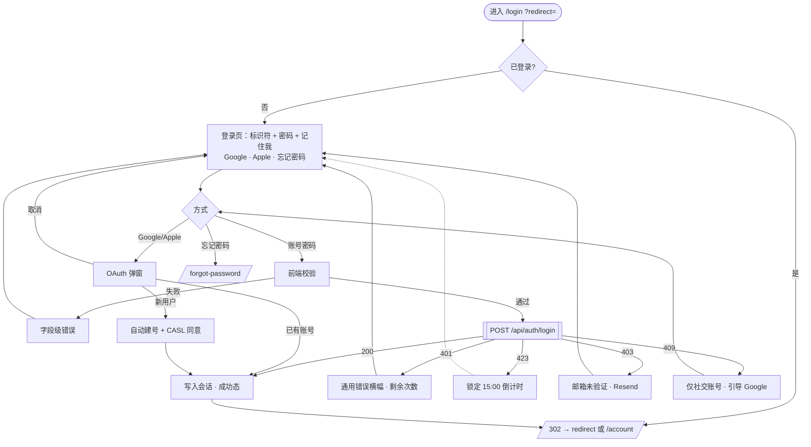
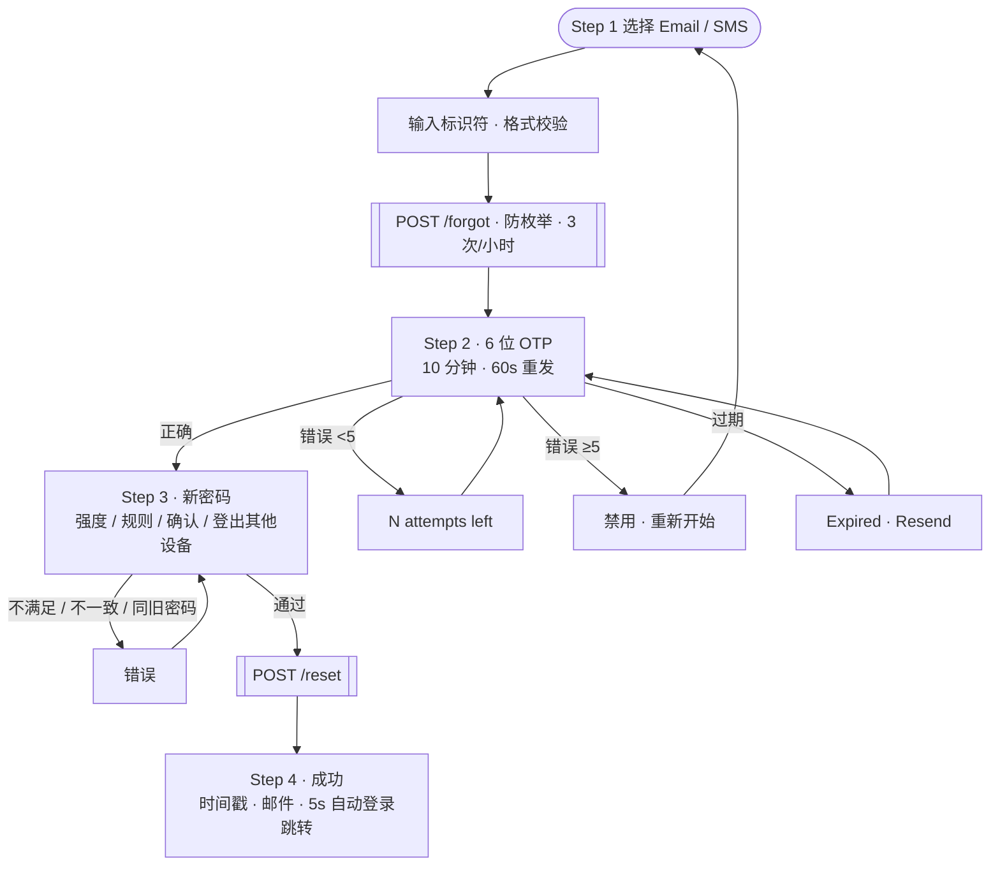
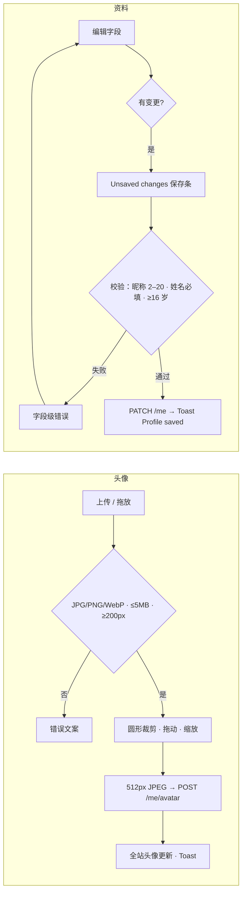

# VANSTRO 账户体系 UX 设计 · 登录 / 忘记密码 / 个人中心 / 结算

面向 **vanstro.ca**（加拿大商城用户）的账户与结账流程设计交付：交互流程图 + 高保真可交互 UI 原型 + 交互说明文档。视觉严格遵循《万拓品牌视觉白皮书》（Vanstro Global Supply Inc.），支持 Google / Apple 登录与 **Moneris** 信用卡支付（GST/HST、PIPEDA）。

## 快速开始（本地）

**静态预览**（仅 HTML 原型，无订单 / 支付 API）：

```bash
cd vanstro-account-ux
python3 -m http.server 8765
# 打开 http://localhost:8765/index.html
```

**同源 API + 结账 / 邮件**（部署与联调用这条）：

```bash
cd vanstro-account-ux
npm install
npm run start                # http://127.0.0.1:8787 · 读已提交 .env（QA mock + ACS）
# 覆盖用 .env.local（gitignore）。生产密钥勿复用 sandbox。
```

| 入口 | 内容 |
|---|---|
| [`index.html`](index.html) | 目录页 + VI 应用规范（色彩 / 字体 / 标识 / 组件）+ 加拿大合规要点 |
| [`flows.html`](flows.html) | 14 张交互流程图 / 状态机 / 时序图 |
| [`login.html`](login.html) | 登录原型（右下角状态面板可切换全部状态；含 CAPTCHA、重定向白名单） |
| [`register.html`](register.html) | 注册原型（邮箱 / Google / Apple Hide My Email · 验证邮箱 · 欢迎优惠 · Guest → 账号 · FR） |
| [`forgot-password.html`](forgot-password.html) | 忘记密码原型（邮件一次性链接 · 12+ 密码策略 · 冻结账号） |
| [`account.html`](account.html) | 个人中心原型（Overview 含最近订单 / 会员等级 / 税率提示 · Profile · Sign-in & security · Orders & quotes · Addresses · Payment methods · Communications · Privacy） |
| [`cart.html`](cart.html) | 购物车原型（数量步进 · 移除 / 撤销 · 稍后再买 · 库存不足 / 下架 / 价格变动阻断 · 促销码 · 按省预估税 · FR；与 `checkout.html` 共享 `localStorage` 快照） |
| [`checkout.html`](checkout.html) | 结算支付原型（三步 Shipping → Review → Payment · GST/HST/PST/QST 计税 · Moneris Hosted Tokenization + REST `/payments` · PIPEDA 同意 · 即时回执） |
| [`components.html`](components.html) | **shadcn/ui 组件切片页**：每个组件的 shadcn 映射、variant、状态 |
| [`shadcn/`](shadcn/) | `globals.css` 主题变量（VI → shadcn）· `components.json` · 扩展 variant 的 `button / alert / badge` · 账户与结账业务组件 · `lib/`（zod 校验、加拿大税、Moneris）· `app/api/` 结账 route handlers |
| [`docs/`](docs/) | `00`–`08` 交互与合规 · **`09-deploy-handoff.md`（部署交接，2026-09-06）** · `10-pos-channel.md` · `11-guest-checkout.md` · **`deploy-agent-prompt.md`** |
| [`exports/`](exports/) | 关键状态 PNG 截图与流程图 PNG（供 PPT / PRD 引用） |
| [`assets/vi.css`](assets/vi.css) · [`assets/vi.js`](assets/vi.js) | 设计令牌、组件样式、图标与校验工具，可直接复用到前端工程 |

## 部署交接

本目录是 **账户 / 购物车 / 结账** 的交付包：静态 HTML 原型 + 可挂载的 `shadcn/app/api/*` 与 `scripts/dev-server.mts`（Node 同源服务）。

| 模块 | 页面 / 源码 | 说明 |
|---|---|---|
| 登录 | `login.html` · `docs/01-login.md` · `shadcn/app/api/auth/*` | UI 原型完整；auth API 为可迁入 Next 的 handler 骨架 |
| 注册 | `register.html` · `docs/07-register.md` · `auth/register` · `verify-email` | 同上 |
| 忘记密码 | `forgot-password.html` · `docs/03-forgot-password.md` · `auth/forgot` · `auth/reset` | 邮件一次性链接 |
| 个人中心 | `account.html` · `docs/02-account.md` · `shadcn/components/account/` | UI 原型完整 |
| 商品列表 | `products.html` · `assets/catalogue-data.js` · `shadcn/lib/catalogue-snapshot.json` | 140 个真实 SKU 快照；Add to cart 写 `vs.cart`；服务端同一快照计价 |
| 购物车 | `cart.html` · `assets/site-header.js` · `site-footer.js` · `storefront-chrome.css` | 与结账共享 `localStorage['vs.cart']` |
| 访客下单 / 查单 | `order-status.html` · `shadcn/lib/order-access.ts` · `rate-limit.ts` · `api/orders/lookup` · `api/orders/claim` · `docs/11-guest-checkout.md` | 未登录付款；HMAC token 查单 / 发票；注册后认领 |
| 付款 | `checkout.html` · `assets/moneris-client.js` · `session.js` · `app/api/orders` · `checkout/moneris/pay` · `orders/:id/push-pos` · `moneris/go/postback` | 通道 1 顾客 HT；通道 2 经销商 Go Cloud POS。已提交 `.env` 默认 mock |

**运行时：** Node 20+ · `npm run start` · 默认 `127.0.0.1:8787` · 已提交 `.env`（QA sandbox + ACS）。  
**仍 gitignore：** `.env.local`（覆盖用）、`data/` 订单落盘。生产密钥不要复用 sandbox。  
**两条通道：** 顾客结账 Pay ≠ 经销商账户 Pay，见 `docs/10-pos-channel.md`。HT Source Domain 须等于页面 origin。完整步骤与验收：`docs/09-deploy-handoff.md`。Agent 提示词：`docs/deploy-agent-prompt.md`。

## 需求覆盖对照

### 1. 用户登录流程
| 要求 | 实现 |
|---|---|
| 用户名 / 邮箱 / 手机号 + 密码 | 单输入框自动识别三种标识符（右侧芯片 Email / Mobile · CA / Username），加拿大 +1 手机 10 位校验 |
| 密码可见 / 隐藏 | 眼睛按钮切换，`aria-pressed`；Caps Lock 提示 |
| 记住我 | 30 天持久会话，默认不勾选，hover 说明 |
| 登录失败提示 | 前端字段级错误；服务端：通用凭证错误（防枚举 + 剩余次数）、5 次锁定 15 分钟倒计时、邮箱未验证、仅社交账号 |
| 成功跳转 | 全屏成功态 → 同源 `?redirect=`（默认 `/account`，结算回跳 `/checkout`） |
| Google / Apple | OIDC + PKCE 时序；已有账号直接登录；首次登录自动建号 + CASL 营销同意弹窗；Apple Hide My Email |

### 2. 个人中心
| 要求 | 实现 |
|---|---|
| 查看 / 修改基本信息 | 昵称、姓、名、性别（含 Non-binary / Prefer not to say）、生日（≥16 岁）、语言 EN/FR、省份；未保存更改浮动保存条 + 实时校验 |
| 修改登录密码 | 当前密码 + 新密码（强度条 / 规则）+ 确认；成功登出其他设备并邮件通知 |
| 上传 / 更换头像 | 点击 / 拖放；类型 · 5 MB · 200px 三重校验；圆形裁剪 + 缩放；512px 输出；移除恢复首字母 |
| 地址簿 | 添加 / 编辑 / 删除，默认收货 / 账单；Canada Post 格式、邮编自动格式 + FSA 与省份交叉校验、PO Box 拦截、+1 电话、配送说明 |
| 支付方式 | 已保存卡列表（品牌标 / 掩码 / 到期提醒 / 过期）；添加卡：品牌识别 + Luhn + MM/YY + CVV + 账单地址 + 银行拒绝态；编辑卡号只读；tokenization 说明 |
| 其他 | 邮箱 / 手机变更（密码 + 新地址 OTP）、Google / Apple 关联与解绑保护、两步验证、已登录设备、删除账号（CRA 保留说明） |

### 3. 忘记密码
| 要求 | 实现 |
|---|---|
| 手机号 / 邮箱身份验证 | Step 1 渠道选择 → Step 2 六位 OTP（10 分钟过期、60s 重发、5 次错误锁定、粘贴自动填充） |
| 设置新密码 | Step 3 强度条 / 规则清单 / 确认一致 / 弱口令拦截 / 与旧密码相同拦截 / 登出其他设备 |
| 成功反馈 | Step 4 时间戳 + 确认邮件 + 清单 + 5s 自动回到登录并自动建立会话 |

### 4. 结算 / 支付
| 要求 | 实现 |
|---|---|
| 信用卡 · Moneris | Hosted Tokenization iframe（PAN 不经 Vanstro）→ 临时 token → 服务端 POST /payments 权威确认（SUCCEEDED 才算付）；3-D Secure、拒绝（050/051/076）、会话过期态、payment_pending / payment_unavailable；已存卡仅 CVV |
| HST / 加拿大税 | 按送达省：HST 13–15%（NS 14%）或 GST±PST/QST；分 + 税票印 BN |
| PIPEDA / Law 25 / 消费者保护 | Review 步先披露含税总额、送达预估、退货政策，再勾选 Terms + Privacy；字段用途说明；隐私通知弹窗；QC 法文税行与 Law 25 通知 |
| 即时回执 | 批准后立即发送交易邮件（可选 SMS）+ 站内税票 / 重发 / 打印；邮件失败态可改地址重发 |
| 视觉 | 与登录 / 个人中心共用 `vi.css` 顶栏、按钮、卡片、EN/FR |

## VI 白皮书落地摘要

| 白皮书 | 应用 |
|---|---|
| 深藏青 `#004744` | 主按钮、标题、链接、选中态 |
| 豆绿灰 `#9BA8A2` | 占位符、描边、禁用、分隔 |
| 青翠绿 `#0D8968` | 成功、焦点环、进度、深色底标语 |
| 暖阳橙 `#F5A93F` | 少量：警告、待办、未验证标签 |
| 深色底 `#021816` + 反白稿 | 登录页品牌区、Toast、保存条 |
| HarmonyOS Sans Bold | 标题 / 按钮 / 标语（Web 回退 Inter → system-ui） |
| 标准英文标识 / 反白稿 / 辅助图形 | 浅色底 / 深色底 / 低透明背景装饰（同版面含公司全称） |
| 标语 YOUR GLOBAL SUPPLY PLATFORM | 品牌区，0.28em 字距大写 |

功能色错误红 `#C8412B` 为白皮书未定义的扩展色，仅用于表单错误与危险操作（详见 `docs/00-design-system.md`）。

## 核心流程图（完整 14 张见 `flows.html`）

### 登录总流程



### 忘记密码



### 个人中心 · 头像与资料



## 加拿大本地化与合规

- 手机 +1 / 10 位校验；SMS 费率提示；时间 America/Winnipeg；价格 CAD；省份用于税费与运费。
- EN / FR 切换与偏好语言（魁北克 Bill 96 / Law 25）。
- PIPEDA：可选字段说明用途；删除账号说明 CRA 6 年保留；结账明示同意 + 加密声明。
- CASL：营销邮件明示同意，默认不勾选，记录时间戳；订单回执为交易邮件，不依赖营销同意。
- 安全：防枚举文案、失败锁定、一次性 OTP、重置后撤销会话、敏感变更双重确认、不可解绑最后一种登录方式。

## 前端落地：shadcn/ui 组件切片

项目前端使用 shadcn/ui。原型中的每个界面元素都已切片并映射到 shadcn 原件或自定义业务组件，见 [`components.html`](components.html)（可视化）与 [`docs/04-shadcn-ui-slices.md`](docs/04-shadcn-ui-slices.md)（清单）。

- **主题**：`shadcn/globals.css` 把 VI 色映射到 `--primary`（深藏青）/ `--accent` `--ring`（青翠绿）/ `--destructive`（扩展错误红）/ `--muted`（grey-50）等语义变量，并暴露 `brand-navy-900`、`brand-orange` 等品牌扩展色作为 Tailwind 工具类；`--radius: 0.5rem`，控件高度 `h-control` = 46px。
- **需扩展的原件**：`button`（+ `google` `apple` `accent` `danger-outline`，`loading`）· `alert`（error / warning / success / info）· `badge`（navy / green / orange / error）· `avatar`（sm / md / xl）· `radio-group`（segmented）。
- **业务组件**：`PasswordInput` `PasswordStrength` `IdentifierInput` `OtpField` `Stepper` `SocialButtons` `AvatarUploader` `AvatarCropDialog` `SaveBar` `KeyValueRow` `LinkedAccountRow` `SessionRow` `AddressCard` `AddressFormDialog` `PaymentMethodRow` `CardBrandBadge` `CardNumberInput` `CardFormDialog` `EmptyState` `ConfirmRemoveDialog`。
- **校验**：`shadcn/lib/validators.ts` 以 zod 实现原型中的全部规则（标识符识别、密码强度、OTP、地址 FSA ↔ 省份、PO Box、Luhn / 品牌 / 到期）。

```bash
npx shadcn@latest init && npx shadcn@latest add button input label form checkbox switch select radio-group \
  input-otp dialog alert-dialog alert badge sonner card separator avatar progress breadcrumb toggle-group \
  tooltip command popover skeleton sidebar dropdown-menu slider
```

## 目录

```
vanstro-account-ux/
├── index.html                # 目录 + 设计规范
├── flows.html                # 交互流程图（Mermaid）
├── login.html                # 登录原型（CAPTCHA · 重定向白名单）
├── register.html             # 注册原型
├── forgot-password.html      # 忘记密码原型（邮件一次性链接）
├── account.html              # 个人中心原型
├── components.html           # shadcn/ui 组件切片页
├── cart.html                 # 购物车原型
├── checkout.html             # 结算 / 支付原型
├── export-screens.py         # 批量导出 exports/*.png（headless Chrome）
├── shadcn/
│   ├── globals.css           # shadcn 主题变量（VI 映射，Tailwind v4；含 v3 fallback）
│   ├── components.json
│   ├── components/ui/        # button / alert / badge（扩展 variant）
│   ├── components/account/   # password-input / address-card / card-brand-badge
│   ├── components/checkout/  # checkout-stepper / tax-lines / consent-group / saved-card-picker / moneris-hosted-fields
│   ├── components/layout/    # SiteHeader / SiteFooter / CookiePreferencesButton —— 原样搬自 vanity-selector 店面源码（参考件：依赖店面的 StorefrontProvider / LocaleProvider / lib/i18n 等，本仓库不含，故 tsconfig 排除 components/）
│   ├── app/api/              # 结账 route handlers：checkout/quote · checkout/payment-config · orders · checkout/moneris/pay · orders/[orderNo]/receipt/resend
│   └── lib/                  # validators.ts（zod）· tax.ts（GST/HST/PST/QST）· moneris.ts（HT + REST /payments）· payments.ts（订单↔Moneris 接缝）· checkout.ts（结账 schema · 促销码）
├── assets/
│   ├── vi.css  vi.js         # 令牌 / 组件 / 图标 / 校验
│   ├── brand/                # logo-navy / logo-reverse / logo-green / mark（自白皮书提取）
│   └── vendor/mermaid.min.js
├── docs/                     # 00 设计规范 · 01 登录 · 02 个人中心 · 03 忘记密码 · 04 shadcn 切片 · 05 结算 · 06 错误码 · 07 注册 · 08 加拿大合规
└── exports/                  # PNG 截图（python3 export-screens.py 重新生成）
```
