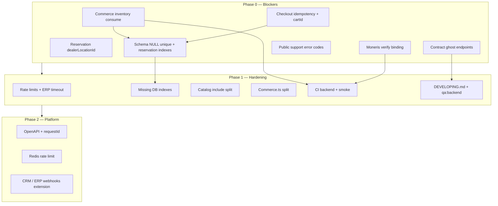

# VanStro 后端完整修复计划

**目标：** 在启用 Moneris 生产流量、对外 API 承诺、以及规模化 catalog 流量之前，消除所有审查 Agent 交叉确认的 blocker。

**原则：**

1. **正确性优先** — commerce 库存账本与支付校验先于重构与优化  
2. **契约与实现同步** — 改 API 必同步 `api-contract.ts`、`api-client.ts`、readiness 文档  
3. **可验证** — 每个阶段有 migration + 单测 + smoke 断言  
4. **最小 diff** — 不做无关重构；`commerce.ts` 拆分放在 P1 功能修复之后  

**当前基线（2026-07-26）：**

- `pnpm typecheck` 通过  
- `pnpm test:api` 54/54 通过  
- `api:smoke` 本地通过（未进 CI）  

---

## 依赖关系总览



---

## Phase 0 — 上线 Blocker（必须先完成）

**预计：** 2–3 个 PR + 1 个 schema migration  
**发布门禁：** P0 全部完成 + `api:smoke` 通过 + 新增单测绿  

### WS-0A Commerce 正确性

#### 0A-1 支付成功后释放 `quantityReserved`

| 项 | 内容 |
|----|------|
| **文件** | `apps/api/src/routes/commerce.ts`（支付回调事务 ~518–572） |
| **问题** | `inventoryReservation.updateMany({ status: "consumed" })` 未减 snapshot.`quantityReserved` |
| **实现** | 在同事务内：对每个 active reservation，`inventorySnapshot.update({ quantityReserved: { decrement: qty } })` |
| **业务决策** | **是否同时 `quantityOnHand -= qty`？** 建议 Phase 0 仅减 `quantityReserved`（与 worker 过期释放语义一致）；`quantityOnHand` 由 ERP 库存同步更新（文档化） |
| **测试** | 扩展 `payment-callback.test.ts`：断言 callback 前后 `quantityReserved` 回到基线 |
| **Smoke** | 在 `smoke.ts` checkout→callback 路径加 DB 断言（可选，单测为主） |

#### 0A-2 Moneris `verify` 绑定 session 与金额

| 项 | 内容 |
|----|------|
| **文件** | `apps/api/src/payments/moneris.ts`, `apps/api/src/routes/commerce.ts` |
| **实现** | 1) 回调先 `findUnique` payment session；2) `verify` 传入 `session.totalCents`；3) 解析 receipt 校验 `order_no === sessionId` 且金额匹配（容差 0 分） |
| **测试** | `payments.test.ts`：错误 order_no / 错误金额 → `ok: false` |
| **配置** | 生产前完成 `docs/reports/moneris-credentials-checklist.md` |

#### 0A-3 防重复 checkout + `PaymentSession.cartId`

| 项 | 内容 |
|----|------|
| **Schema** | `PaymentSession` 增加 `cartId String?` + FK → `Cart`；partial unique index 见 WS-0B |
| **文件** | `commerce.ts` `POST /checkout/session` |
| **实现** | 解析 cart 后：若存在同 `cartId` 的 pending 未过期 session → 返回 409 `CHECKOUT_INVALID` 或复用现有 session（**推荐 409**，简单明确） |
| **测试** | 新测：同一 cart 连续两次 checkout → 第二次 409 |

#### 0A-4 独立库存预留 `dealerLocationId` 一致性

| 项 | 内容 |
|----|------|
| **文件** | `commerce.ts` `POST/DELETE /inventory/reservations` |
| **实现** | 方案 A（推荐）：`dealerLocationId` **必填**；方案 B：从 matched snapshot 写入真实 `dealerLocationId` |
| **测试** | POST 不传 dealer → 400；POST+DELETE 后 snapshot.`quantityReserved` 正确回滚 |

#### 0A-5 快照 TTL 仅校验履约经销商

| 项 | 内容 |
|----|------|
| **文件** | `commerce.ts` 425–431 |
| **实现** | 在解析出 `dealerLocationId` 后，仅对该经销商的 snapshots 做 TTL 检查；未指定 dealer 时在候选履约经销商集合上检查 |
| **测试** | 单测：一经销商陈旧、另一新鲜 → checkout 仍成功 |

---

### WS-0B Database migration（与 0A 同 PR 或紧跟）

**Migration 名称建议：** `20260726140000_commerce_inventory_hardening`

```sql
-- 1. PaymentSession.cartId
ALTER TABLE "payment_sessions" ADD COLUMN "cartId" TEXT;
ALTER TABLE "payment_sessions" ADD CONSTRAINT "payment_sessions_cartId_fkey"
  FOREIGN KEY ("cartId") REFERENCES "carts"("id") ON DELETE SET NULL;

-- 2. 防重复 pending checkout（每 cart 仅一个 pending session）
CREATE UNIQUE INDEX "payment_sessions_cart_pending_unique"
  ON "payment_sessions" ("cartId")
  WHERE "status" = 'pending' AND "cartId" IS NOT NULL;

-- 3. inventory_snapshots NULL 唯一（PG 15+）
ALTER TABLE "inventory_snapshots"
  DROP CONSTRAINT "inventory_snapshots_skuId_dealerLocationId_key";
CREATE UNIQUE INDEX "inventory_snapshots_sku_dealer_unique"
  ON "inventory_snapshots" ("skuId", "dealerLocationId")
  NULLS NOT DISTINCT;

-- 4. 预留查询与幂等
CREATE INDEX "inventory_reservations_payment_session_idx"
  ON "inventory_reservations" ("paymentSessionId")
  WHERE "paymentSessionId" IS NOT NULL;

CREATE UNIQUE INDEX "inventory_reservations_active_session_sku_unique"
  ON "inventory_reservations" ("paymentSessionId", "skuId")
  WHERE "status" = 'active' AND "paymentSessionId" IS NOT NULL;

CREATE INDEX "inventory_reservations_sku_dealer_status_idx"
  ON "inventory_reservations" ("skuId", "dealerLocationId", "status");

-- 5. ErpOrderLink FK（若尚未存在）
-- Prisma: websiteOrderId → Order @relation
```

**Prisma schema 同步：**

- `PaymentSession.cartId` + relation  
- `InventorySnapshot` unique 改为 `@@unique([skuId, dealerLocationId])` + `map` 或 raw migration  
- `ErpOrderLink.websiteOrderId` → `Order` FK  

**Seed：** 无需变更（除非清理重复 NULL snapshot 行 — migration 前跑数据修复脚本）

**数据修复（migration 前）：**

```sql
-- 检查重复 NULL dealer snapshots
SELECT "skuId", COUNT(*) FROM inventory_snapshots
WHERE "dealerLocationId" IS NULL GROUP BY 1 HAVING COUNT(*) > 1;
```

---

### WS-0C API 契约 P0 对齐

| # | 任务 | 文件 |
|---|------|------|
| 0C-1 | 删除或 `@deprecated` `createDirectOrder` / `createCartOrder`；文档指向 `createCheckoutSession` | `api-client.ts`, `api-contract.ts` |
| 0C-2 | `createPaymentSession` → 调用 `POST /checkout/session` 或移除 | `api-client.ts` |
| 0C-3 | `assignOrderDealer` 路径改为 `POST /dashboard/orders/:id/assign-dealer` | `dashboard-contract.ts`, `api-client.ts` |
| 0C-4 | Support handoff 响应统一 `{ id, status }`；更新 client validator | `support.ts`, `api-client.ts` |
| 0C-5 | 公开 `support/handoffs` 改用 `publicError` + `SUBMISSION_INVALID` | `dashboard/support.ts` |
| 0C-6 | 更新 `DASHBOARD_MODULE_READINESS`：cart/auth/favorites/checkout → `client-ready` | `dashboard-contract.ts` |
| 0C-7 | 归档或重写 `docs/API-MODULE-READINESS-v1.md`；指向 `API-CONTRACT-ALIGNMENT.md` | docs |

**验收：** `pnpm test:package-contracts` 通过；`api-client` 无指向 404 路径的默认调用。

---

### Phase 0 验收清单

```bash
pnpm db:migrate && pnpm db:seed
pnpm typecheck
pnpm test:api          # 含新增 commerce/payment 测试
pnpm api:smoke
```

| 断言 | 方式 |
|------|------|
| 支付后 `quantityReserved` 不永久抬高 | 单测 |
| Moneris 错误 ticket 被拒绝 | 单测 |
| 重复 checkout 409 | 单测 |
| 预留释放 dealer 一致 | 单测 |
| Migration 可重复 apply（新库） | 本地 migrate dev |
| 幽灵端点已移除/修正 | package-contracts |

**Phase 0 完成标准：** Moneris 可在 staging 开启；commerce 路径无已知 blocker。

---

## Phase 1 — 加固与可维护性（1–2 sprint）

### WS-1A 安全与可靠性

| # | 任务 | 文件 | 说明 |
|---|------|------|------|
| 1A-1 | ERP Product client 15s 超时 | `integrations/erp-product/client.ts` | 对齐 Worker/Moneris |
| 1A-2 | `/checkout/session`、`/payments/callback`、`/cart/*` 限流 | `middleware/rate-limit.ts` | 独立 bucket |
| 1A-3 | 429 响应加 `Retry-After`（已有）+ 可选 `X-RateLimit-*` | `rate-limit.ts` | 文档化限额 |
| 1A-4 | `guestOrderToken` 迁移计划 | 契约文档 | 短期保留 query；P2 改 header |

### WS-1B 数据库索引（生产 CONCURRENTLY）

**Migration：** `20260727000000_query_performance_indexes`

```sql
CREATE INDEX CONCURRENTLY IF NOT EXISTS idx_orders_guest_order_token
  ON orders ("guestOrderToken");
CREATE INDEX CONCURRENTLY IF NOT EXISTS idx_payment_sessions_guest_order_token
  ON payment_sessions ("guestOrderToken");
CREATE INDEX CONCURRENTLY IF NOT EXISTS idx_prices_sku_status_created
  ON prices ("skuId", status, "createdAt" DESC);
CREATE INDEX CONCURRENTLY IF NOT EXISTS idx_dealer_service_areas_type_code
  ON dealer_service_areas ("areaType", "areaCode");
CREATE INDEX CONCURRENTLY IF NOT EXISTS idx_products_active_created
  ON products ("createdAt" DESC) WHERE status = 'active';
```

### WS-1C 代码结构

| # | 任务 | 说明 |
|---|------|------|
| 1C-1 | 拆分 `commerce.ts` → `cart.ts`, `checkout.ts`, `payments.ts`, `account-commerce.ts` | 保持 `createCommerceRoutes` 聚合挂载 |
| 1C-2 | `productDisplayInclude` 拆为 `productListInclude` / `productDetailInclude` | 列表页不加载全量 reviews + 全 snapshots |
| 1C-3 | Dashboard 错误 helper：全面 `code` 字段 | `dashboard.ts`, `system.ts`, `cli.ts`, `mcp.ts` |
| 1C-4 | `PUBLIC_API_ERROR_CODES` 单源 | `api-contract.ts` export → `public-errors.ts` re-export |

### WS-1D 开发者工具链

| # | 任务 | 文件 |
|---|------|------|
| 1D-1 | `docs/DEVELOPING.md` 全栈黄金路径 | 新建 |
| 1D-2 | 根 README 增加 Backend 章节链接 | `README.md` |
| 1D-3 | `qa:backend` = typecheck + test:api + api:smoke | `package.json` |
| 1D-4 | `test:api` glob → `src/**/*.test.ts` | `apps/api/package.json` |
| 1D-5 | GitHub Actions `backend-ci.yml`：Postgres service + migrate + seed + test:api + api:smoke | `.github/workflows/` |
| 1D-6 | CLI：`--help`, `--version`, 可行动错误（token 创建指引） | `packages/cli/` |
| 1D-7 | 跨平台 env：`scripts/with-env.mjs` 替代 bash `set -a` | `package.json` scripts |
| 1D-8 | seed ERP 系统名统一 `vanstro-erp` | `packages/db/src/seed.ts` |

### WS-1E 权限与数据模型（可选本阶段）

| # | 任务 |
|---|------|
| 1E-1 | 补充 permissions：`dealers.*`, `tax_rates.*`, `inventory.write` |
| 1E-2 | `PaymentSession`/`Order.dealerLocationId` FK → `DealerLocation` |
| 1E-3 | `InventoryReservation.orderId` 可选字段（支付后写入） |

### Phase 1 验收

```bash
pnpm qa:backend    # 新脚本
pnpm qa:ci         # 前端门禁不变
```

---

## Phase 2 — 平台化与扩展（中期）

### WS-2A API 平台

| # | 任务 |
|---|------|
| 2A-1 | 从 `api-contract.ts` 生成 OpenAPI 3.1 |
| 2A-2 | CI spec-diff 阻断 breaking change |
| 2A-3 | 全局 `requestId` 中间件 + 错误/meta 统一 |
| 2A-4 | `Idempotency-Key` on `POST /checkout/session` |
| 2A-5 | Partner ERP 文档（机器 API + webhook） |

### WS-2B 性能与搜索

| # | 任务 |
|---|------|
| 2B-1 | `pg_trgm` + `products.name` GIN 索引 |
| 2B-2 | ERP catalog export lean query / raw SQL |
| 2B-3 | Redis 分布式 rate limit（多实例部署时） |

### WS-2C Schema 演进

| # | 任务 |
|---|------|
| 2C-1 | `TaxRate` 历史版本 `(province, effectiveFrom)` |
| 2C-2 | CMS `status` → Prisma enum |
| 2C-3 | 逐步废弃 `Product.finishOptions` JSON |
| 2C-4 | `audit_logs` / `login_events` 留存索引 + cron |

### WS-2D 集成功能（需业务输入）

| # | 任务 | 依赖 |
|---|------|------|
| 2D-1 | `POST /integrations/erp/webhooks/shipment` | ERP 团队契约 |
| 2D-2 | 入站库存同步 → `InventorySnapshot` | ERP 团队契约 |
| 2D-3 | CRM API 全套 | **CRM API 文档** |

### WS-2E 工程体验

| # | 任务 |
|---|------|
| 2E-1 | `pnpm stack:dev`（overmind/compose） |
| 2E-2 | smoke 按域拆分 `smoke/commerce.ts` 等 |
| 2E-3 | `turbo` 并行 typecheck |
| 2E-4 | CLI shell completions |

---

## PR 拆分建议

| PR | 内容 | Phase |
|----|------|-------|
| **PR-1** | Migration WS-0B + schema.prisma | P0 |
| **PR-2** | Commerce 0A-1~0A-5 + 单测 | P0 |
| **PR-3** | Moneris 0A-2 + payment 单测 | P0 |
| **PR-4** | Contract 0C-1~0C-7 + package-contracts | P0 |
| **PR-5** | Rate limit + ERP timeout + indexes migration | P1 |
| **PR-6** | commerce.ts 拆分 + catalog include | P1 |
| **PR-7** | DEVELOPING.md + backend-ci.yml + qa:backend | P1 |
| **PR-8** | Dashboard 错误 code 统一 | P1 |

**合并顺序：** PR-1 → PR-2 + PR-3（可并行）→ PR-4 → 验收 → P1 PRs。

---

## 风险与回滚

| 风险 | 缓解 |
|------|------|
| NULLS NOT DISTINCT 需 PG 15+ | 确认生产 PG 版本；否则用 sentinel `dealerLocationId` |
| `payment_sessions` partial unique 与现有数据冲突 | migration 前清理 duplicate pending sessions |
| Moneris receipt 字段名与 esqa 不一致 | staging 实测 receipt JSON；单测用 fixture |
| 契约变更破坏前端 | package-contracts + 协调前端切 `checkout/session` |
| CONCURRENTLY 索引失败 | 低峰执行；单独 migration PR |

**回滚：** 每 PR 独立 revert；schema migration 写逆向 SQL 备查（Prisma 无 auto-down）。

---

## 人力与工期估算

| Phase | 工作量 | 日历（1 全职后端） |
|-------|--------|-------------------|
| P0 WS-0A~0C | 3–5 人日 | ~1 周 |
| P1 全部 | 5–8 人日 | ~1.5–2 周 |
| P2 按需 | 10+ 人日 | 分 sprint 排期 |

---

## 发布检查表（生产前）

- [ ] P0 全部完成  
- [ ] `pnpm qa:backend` 在 CI 绿  
- [ ] Moneris staging 端到端支付  
- [ ] `PAYMENT_PROVIDER=moneris` + 凭证 checklist 完成  
- [ ] `VANSTRO_RUNTIME_MODE=deployment` + secret 强度验证  
- [ ] ERP webhook secret 已配置（fail-closed 已测）  
- [ ] 库存策略文档：reserved vs onHand vs ERP 同步  
- [ ] 契约文档与 `api-contract.ts` 一致  
- [ ] 无未修复的 Critical/High 开放项  

---

## 相关文档

| 文档 | 关系 |
|------|------|
| 本计划 | 执行主文档 |
| `docs/API-CONTRACT-ALIGNMENT.md` | 路径真相源（P0 后更新） |
| `docs/reports/erp-product-api-integration-2026-07-26.md` | ERP 产品模块（已完成） |
| `docs/reports/dashboard-erp-crm-handoff-2026-07-26.md` | ERP/CRM 边界 |
| `docs/reports/moneris-credentials-checklist.md` | P0 Moneris 前置 |
| `docs/reports/local-backend-acceptance-2026-07-26.md` | 本地验收命令模板 |

---

## 执行跟踪（完成后勾选）

### Phase 0

- [ ] 0A-1 支付后 quantityReserved  
- [ ] 0A-2 Moneris verify  
- [ ] 0A-3 cartId + 防重复 checkout  
- [ ] 0A-4 reservation dealerLocationId  
- [ ] 0A-5 快照 TTL  
- [ ] 0B migration  
- [ ] 0C 契约对齐  

### Phase 1

- [ ] 1A 安全加固  
- [ ] 1B 索引  
- [ ] 1C 代码结构  
- [ ] 1D 工具链 + CI  
- [ ] 1E 权限/FK（可选）  

### Phase 2

- [ ] 2A OpenAPI  
- [ ] 2B 性能  
- [ ] 2C Schema  
- [ ] 2D ERP/CRM 扩展  
- [ ] 2E DX 进阶  
